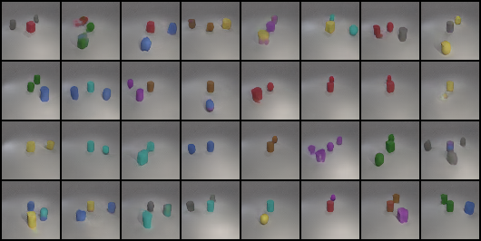

# Geometry Generator - Conditional GANs

The Pytorch implementation of a generator whose goal is to generate sythesiszed images based one conditions.
The model will take random noises and conditions to generate spheres, cylinder, and cubes with different colors. 

## Model Description
The model consists of three components.
- Deep Convolutional GAN
	- each upsampling block consists of 2 convolutional layers and each of them is followed by ReLU and batch normalization
	- each upsampling block consists of 2 conovlutional layers and each of them is followed by LeakyReLU
	- adopt residual connections
	- Use embedding to embeding each color and shape (24 classes) and do summation over embeddings (1 object to 3 objects) to form a condition
- Projection Discriminator
- WGAN-GP


## Training

```
python main.py --checkname <your_dir> --datapath <data_dir>
``` 

Define <your_dir> yourself
Specify the diretory of [i-CLEVR](https://cs.stanford.edu/people/jcjohns/clevr/) dataset in ./data

## Evalutation

```
python main.py --eval --checkname <your_dir>
```

Specify <your_dir> as the model weight in ./logs


## Results

