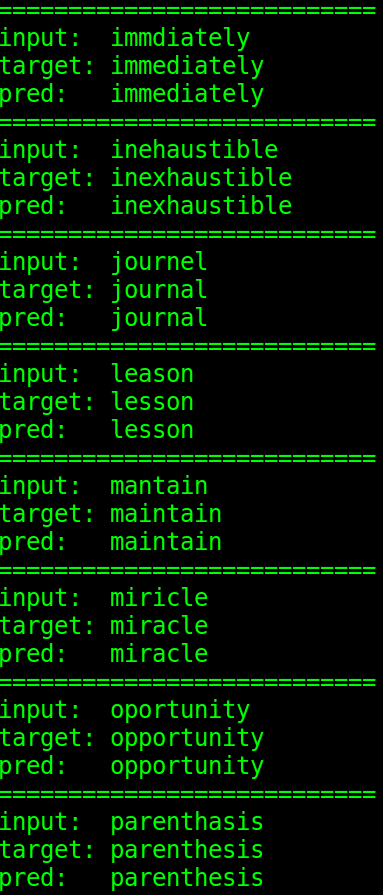

# Spelling Corrector - Sequence-to-sequence Recurrent Neural Networks

The Pytorch implementation of English spelling corrector based one recurrent neural networks.
The model will takes a mistakenly spelling word as input and predicts its corrected one. 

## Training

```
python main.py --checkname <your_dir>
``` 

Define <your_dir> yourself

### Hyper-parameters
|||
|:-----:|:-----:|
|RNN|LSTM|
|Hiddzen size|512|
|Is bi-directional|True|
|Teacher forcing ratio|1.0|
|Word dropout|0.4|
|LR|0.1|
|Optimizer|SGD|
|Batch size|16|


## Evalutation

```
python main.py --eval --checkname <your_dir>
```

Specify <your_dir> as the model weight

## Performance

The performance on test.json:
BLEU-4: 0.93


## Results
